<html lang="fr">
<head>
    <meta charset="UTF-8">
    <meta name="viewport" content="width=device-width, initial-scale=1.0">
    <title>Portfolio Arthur Lamboley</title>
    
</head>
<body>
    

        

            <h1>Arthur Lamboley - Ingénieur en Optique et Photonique</h1>
            
Bonjour ! Je suis Arthur, un étudiant en dernière année à l'école d'ingénieur Télécom Saint-Etienne, spécialisé en optique, photonique, imagerie et vision, avec une passion pour l'innovation dans le domaine de la cosmétique. Ce Portfolio vise à démontrer mes compétences en montrant les différents projets et accomplissement menés durant mon parcours. Voici comment celui-ci s'articule :

            <nav>
                <ul>
                    <li><a href="#projets-stage-expérience">Projets, Stage, Expérience</a></li>
                    <li><a href="#expérience-junior-entreprise">Expérience Junior-Entreprise</a></li>
                    <li><a href="#site-web">Site Web</a></li>
                    <li><a href="#compétences">Compétences</a></li>
                    <li><a href="#cv-et-lettre-de-motivation">CV et lettre de motivation</a></li>
                    <li><a href="#contact">Contact</a></li>
                </ul>
            </nav>
        

<section id="projets-stage-expérience">
<h2>Projets, Stage, Expérience</h2>

  

    
      <h3 style="margin: 0; display: inline;"><u>Safran Tech : étude et automatisation des IQI, réalisation d'une interface graphique</u></h3>
    
  

  
<i>Avril 2024 - Juillet 2024</i>

  
<strong>Technologies :</strong> Python, Qt, Traitement d'image, OpenCV, Template Matching

  
<strong>Description :</strong> Étude et automatisation des indicateurs de qualité d'image (IQI) (3 IQI principaux, un duplex, un convergent, un trou fond plat). Des rapports sont émis automatiquement après chaque exécution. Une interface développée avec Qt Creator permet de lancer chacun des programmes individuellement (ou de tout lancer de manière groupée). L'ensemble a été hébergé sur Git.

  
<strong>Compétences :</strong>

  <ul>
    <li><strong>Automatisation :</strong> Développement de processus automatisés pour l'évaluation des IQI.</li>
    <li><strong>Traitement d'image :</strong> Analyse des images pour détecter et évaluer les défauts.</li>
    <li><strong>Programmation en Python :</strong> Création de scripts pour automatiser les tâches d'analyse.</li>
  </ul>

  

    <figure style="margin: 10px; text-align: center;">
      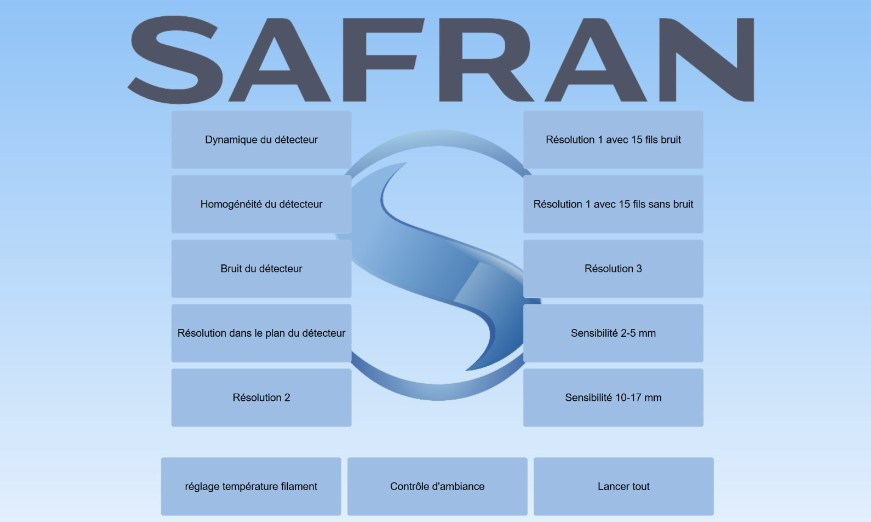
      <figcaption>Fig.1 Interface graphique</figcaption>
    </figure>
    <figure style="margin: 10px; text-align: center;">
      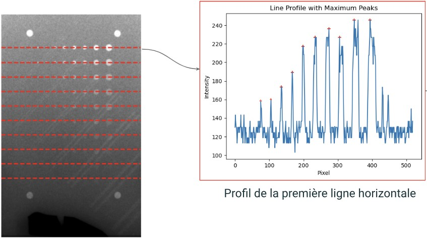
      <figcaption>Fig.2 Détection des trou pour l'IQI trou fond plat</figcaption>
    </figure>
    <figure style="margin: 10px; text-align: center;">
      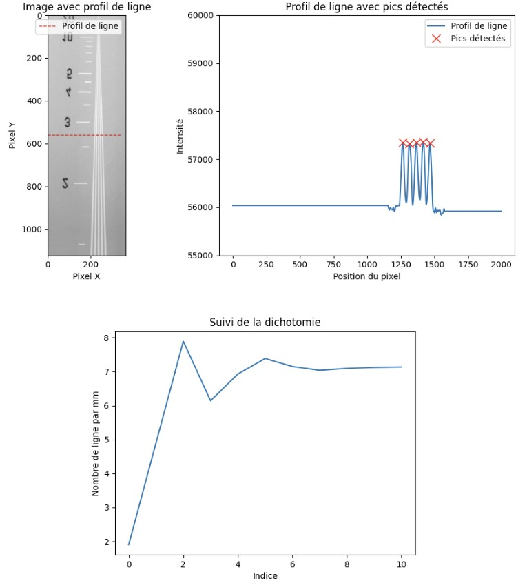
      <figcaption>Fig.3 Dichotomie associée à l'IQI convergent</figcaption>
    </figure>
    <figure style="margin: 10px; text-align: center;">
      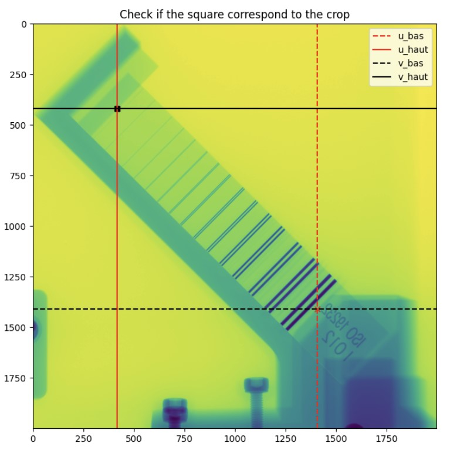
      <figcaption>Fig.4 Template matching pour l'IQI duplex</figcaption>
    </figure>
  

  

    
      <h3 style="margin: 0; display: inline;"><u>Projet d'étude de lentille varifocale</u></h3>
    
  

  
<i>Mai 2024</i>

  
<strong>Technologies :</strong> LightTool, CodeV, CAO

  
<strong>Description :</strong> Modélisation et étude des limites des lentilles à focale variable à l'aide de la conception assistée par ordinateur (CAO).

  
<strong>Compétences :</strong>

  <ul>
    <li><strong>CAO :</strong> Réalisation de système numérique pour modéliser les lentilles.</li>
    <li><strong>Optimisation :</strong> Recherche des rayons de courbure idéaux.</li>
  </ul>

  

    <figure style="margin: 20px; text-align: center;">
      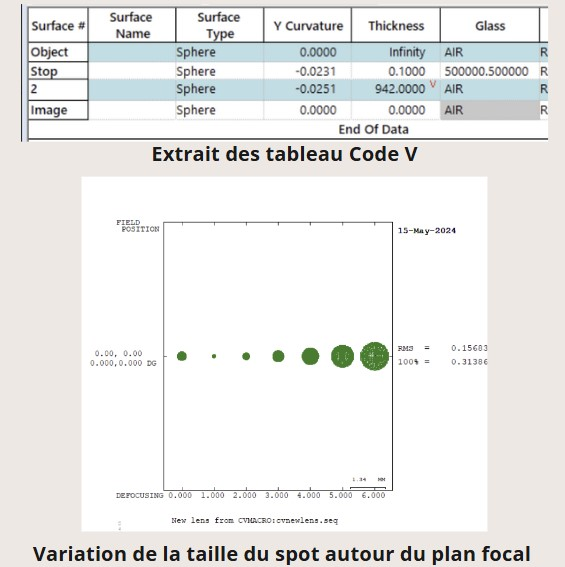
      <figcaption>Fig.1 Table CodeV et évolution d'un spot autour du plan focale</figcaption>
    </figure>
    <figure style="margin: 20px; text-align: center;">
      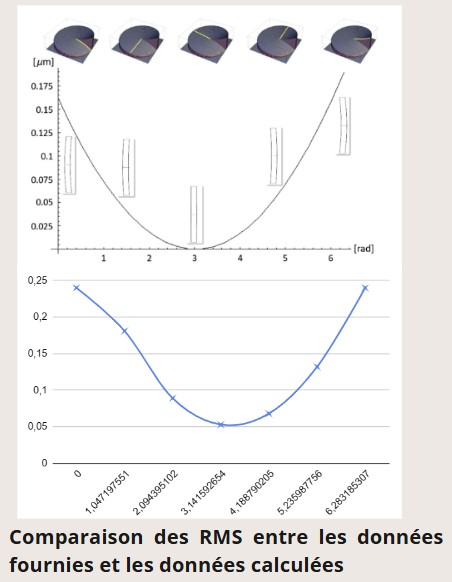
      <figcaption>Fig.2 Comparaison avec un modèle double sphérique</figcaption>
    </figure>
  

  

    
      <h3 style="margin: 0; display: inline;"><u>Projet de détection de défauts industriels</u></h3>
    
  

  
<i>Février 2024</i>

  
<strong>Technologies :</strong> Étude de faisabilité, Système optique

  
<strong>Description :</strong> Études de faisabilité concernant la détection de défauts sur des objets, tels que des fonds de poêle et des flacons de parfum.

  
<strong>Compétences :</strong>

  <ul>
    <li><strong>Analyse de faisabilité :</strong> Évaluation des possibilités et des défis de la détection de défauts.</li>
    <li><strong>Traitement d'image :</strong> Application de techniques pour identifier et analyser les défauts.</li>
  </ul>

  

    <figure style="margin: 20px; text-align: center;">
      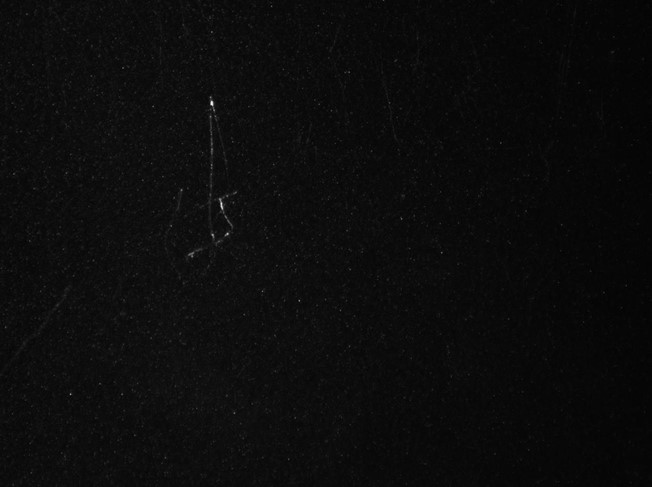
      <figcaption>Fig.1 Détection d'un défaut sur une poêle</figcaption>
    </figure>
    <figure style="margin: 20px; text-align: center;">
      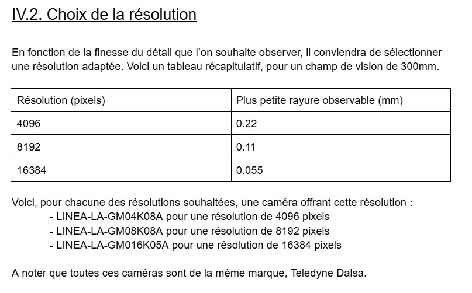
      <figcaption>Fig.2 Extrait du CR de l'étude</figcaption>
    </figure>
  

  

    
      <h3 style="margin: 0; display: inline;"><u>Laboratoire Hubert Curien : conception et réalisation d’un système de recomposition de fréquence</u></h3>
    
  

  
<i>Mai 2023 - Juillet 2023</i>

  
<strong>Technologies :</strong> 3DOptix

  
<strong>Description :</strong> Conception et réalisation d'un système de recomposition de fréquence. Test et rapport avec le logiciel 3DOptix.

  
<strong>Compétences :</strong>

  <ul>
    <li><strong>Conception optique :</strong> Développement de systèmes pour recomposer les fréquences.</li>
    <li><strong>Simulation 3D :</strong> Utilisation de logiciels pour tester et valider les conceptions.</li>
    <li><strong>CAO :</strong> Modélisation avec le logiciel 3DOptix, étude des possibilités du logiciel.</li>
  </ul>

  

    <figure style="margin: 20px; text-align: center;">
      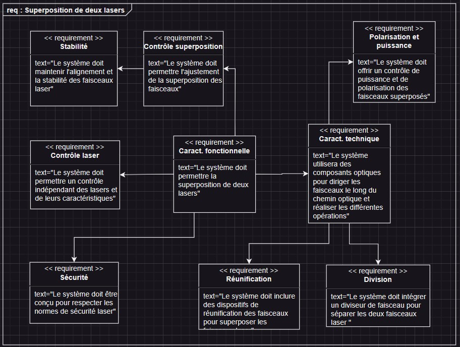
      <figcaption>Fig.1 Diagramme d'exigence</figcaption>
    </figure>
    <figure style="margin: 20px; text-align: center;">
      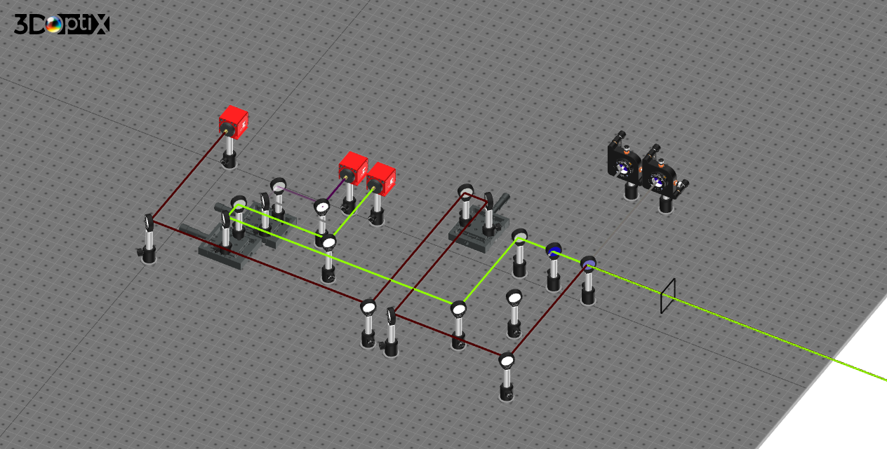
      <figcaption>Fig.2 Conception sur 3DOptix</figcaption>
    </figure>
    <figure style="margin: 20px; text-align: center;">
      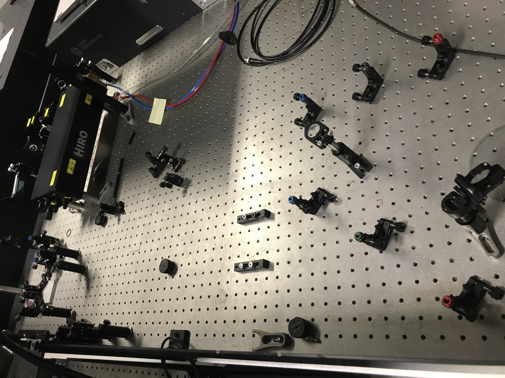
      <figcaption>Fig.3 Mise en place de la solution</figcaption>
    </figure>
  

  

    
      <h3 style="margin: 0; display: inline;"><u>Projet de classification de coquilles Saint-Jacques</u></h3>
    
  

  
<i>Décembre 2023 - Février 2024</i>

  
<strong>Technologies :</strong> NI Vision, Système optique

  
<strong>Description :</strong> Conception d'un système optique et d'éclairage pour la classification de coquilles Saint-Jacques. L'objectif était, en accord avec notre client, de définir puis réaliser un système pour faciliter le tri des coquilles selon certains critères, notamment la couleur, la circularité, la taille, la hauteur ou encore la présence de défaut.

  
<strong>Compétences :</strong>

  <ul>
    <li><strong>Conception de systèmes optiques :</strong> Développement de systèmes pour des applications spécifiques.</li>
    <li><strong>Vision par ordinateur :</strong> Utilisation de techniques de classification pour différencier les coquilles.</li>
  </ul>

  

    <figure style="margin: 20px; text-align: center;">
      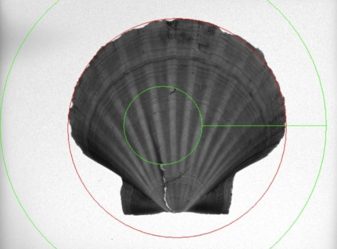
      <figcaption>Fig.1 Calcul de la circularité</figcaption>
    </figure>
    <figure style="margin: 20px; text-align: center;">
      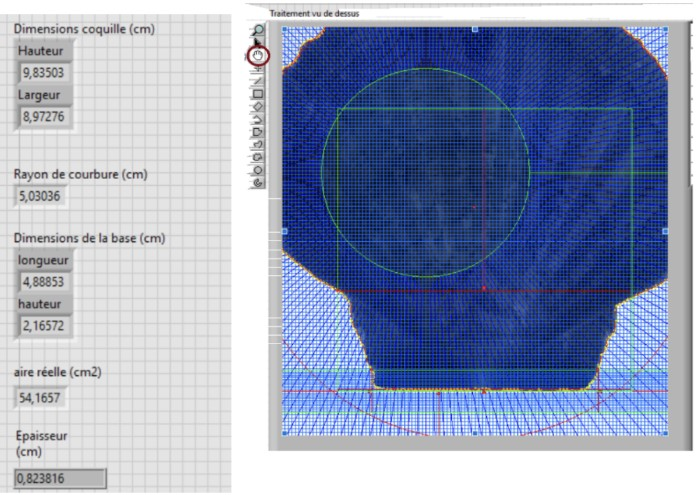
      <figcaption>Fig.2 Interface réalisée</figcaption>
    </figure>
  

  

    
      <h3 style="margin: 0; display: inline;"><u>Projet de classification de coccinelles</u></h3>
    
  

  
<i>Mars 2024 - Mai 2024</i>

  
<strong>Technologies :</strong> Imagerie, MATLAB

  
<strong>Description :</strong> Développement d'un système de classification de coccinelles basé sur de l'apprentissage croisé. Trois critères ont été retenus : le nombre de points, la couleur, et la circularité. Réalisation d'une matrice de confusion pour rendre compte des résultats.

  
<strong>Compétences :</strong>

  <ul>
    <li><strong>Traitement d'image :</strong> Utilisation d'algorithmes pour analyser et classifier les images.</li>
    <li><strong>Vision par ordinateur :</strong> Mise en place de techniques pour la classification des objets.</li>
    <li><strong>Programmation en MATLAB :</strong> Développement d'algorithmes et d'applications.</li>
  </ul>

  

    <figure style="margin: 20px; text-align: center;">
      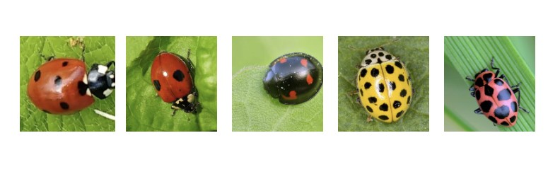
      <figcaption>Fig.1 Individus étudiés</figcaption>
    </figure>
    <figure style="margin: 20px; text-align: center;">
      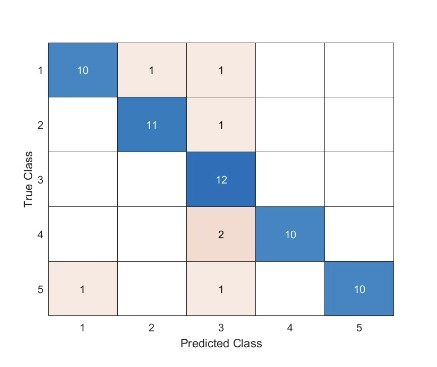
      <figcaption>Fig.2 Matrice de confusion finale</figcaption>
    </figure>
  

  

    
      <h3 style="margin: 0; display: inline;"><u>Projet de suivi d’une balle (vision par ordinateur)</u></h3>
    
  

  
<i>Mars 2023 - Mai 2023</i>

  
<strong>Technologies :</strong> Python, Raspberry Pi, OpenCV

  
<strong>Description :</strong> Développement d'un système de vision par ordinateur pour suivre une balle en mouvement. L'ensemble réalisé sur Raspberry Pi.

  
<strong>Compétences :</strong>

  <ul>
    <li><strong>Traitement d'image :</strong> Capacité à utiliser des algorithmes pour analyser et traiter des images vidéo en temps réel.</li>
    <li><strong>Vision par ordinateur :</strong> Expertise en techniques de détection et de suivi d'objets.</li>
    <li><strong>Programmation en Python :</strong> Développement de scripts et d'applications pour le traitement des données d'image.</li>
    <li><strong>Déploiement sur Raspberry Pi :</strong> Installation, configuration et optimisation d'applications sur des micro-ordinateurs.</li>
  </ul>

  

    <figure style="margin: 20px; text-align: center;">
      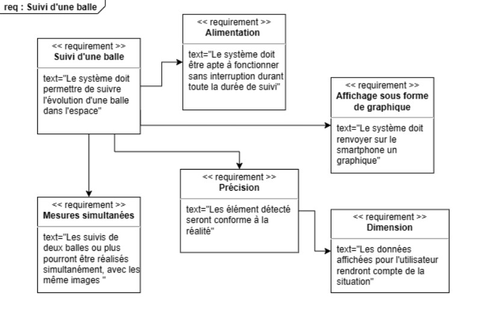
      <figcaption>Fig.1 Diagramme d'exigence</figcaption>
    </figure>
    <figure style="margin: 20px; text-align: center;">
      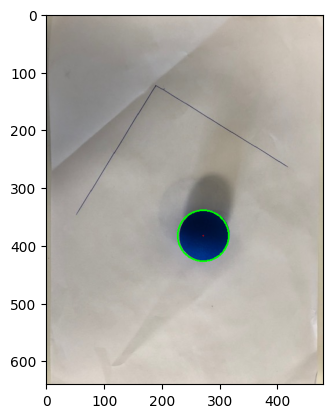
      <figcaption>Fig.2 Détection de la balle</figcaption>
    </figure>
  

</section>

<section id="expérience-junior-entreprise">
<h2>Expérience Junior-Entreprise</h2>

  

    
      <h3 style="margin: 0; display: inline;"><u>Auditeur conseil</u></h3>
    
  

  
<i>Janvier 2024 - Actuellement</i>

  
<strong>Description :</strong> En qualité d'Auditeur-Conseil à la Confédération Nationale des Junior-Entreprises, mon parcours a débuté par une sélection rigoureuse, avec des tests écrits et un week-end de formation, avec un taux de réussite de seulement 7%. En tant qu'Auditeur-Conseil, ma mission d'une journée consiste à :

  <ul>
    <li>Analyser le fonctionnement de la Junior-Entreprise (conformité légale, audit des processus de stratégie et pilotage, activité commerciale, GRH, cadre légal et réglementaire)</li>
    <li>Auditer les missions réalisées par la structure (qualité des livrables, cohérence administrative, respect de la déontologie, ...)</li>
    <li>Conseiller la Junior-Entreprise (solutions aux problèmes rencontrés, optimisation, ...)</li>
  </ul>

  
<strong>Enjeux :</strong>

  <ul>
    <li>Garantir la qualité et la pérennité du Mouvement des Junior-Entreprises</li>
    <li>Développer les structures du mouvement en leur apportant une expertise adaptée</li>
    <li>Assurer le respect de la marque Junior-Entreprise</li>
    <li>Stimuler le développement et l'amélioration des performances de la structure auditée grâce aux conseils stratégiques prodigués</li>
  </ul>

  
<strong>Compétences :</strong>

  <ul>
    <li><strong>Audit :</strong> Analyse stratégique de la structure, respect des normes et des lois</li>
    <li><strong>Conseil :</strong> Formulation de conseils adaptés à la structure, priorisation</li>
    <li><strong>Sens du relationnel :</strong> Bienveillance, compréhension</li>
  </ul>

  

    <iframe src="https://www.linkedin.com/embed/feed/update/urn:li:share:7186641419502067712" height="1298" width="504" frameborder="0" allowfullscreen="" title="Post intégré"></iframe>
  

  

    
      <h3 style="margin: 0; display: inline;"><u>Responsable communication et marketing</u></h3>
    
  

  
<i>Octobre 2022 - Avril 2024</i>

  
<strong>Description :</strong> En tant que Responsable Communication et Marketing au sein d'Inspire, je fais partie intégrante d'une équipe composée de trois personnes, dédiée à la coordination complète de notre communication. Mon rôle consiste à orchestrer la stratégie de communication et marketing, avec pour objectif d'optimiser notre présence et de renforcer notre impact sur le marché.

  
<strong>Mission :</strong>

  <ul>
    <li>Élaborer et mettre en œuvre la stratégie de communication et marketing</li>
    <li>Gérer les canaux de communication (communication sur les réseaux en accord avec la stratégie de la structure)</li>
    <li>Créer du contenu (production de contenus, qualité et pertinence)</li>
    <li>Analyser et optimiser les performances (amélioration continue, ajustement)</li>
  </ul>

  
<strong>Enjeux :</strong>

  <ul>
    <li>Élever la notoriété de la marque</li>
    <li>Accroître la fidélité client grâce à des initiatives de communication</li>
    <li>Assurer la cohérence de la stratégie de communication</li>
    <li>Optimiser les performances pour une croissance continue</li>
  </ul>

  
<strong>Compétences :</strong>

  <ul>
    <li><strong>Communication :</strong> Communication visuelle, relation presse, conception de matériel de prospection</li>
    <li><strong>Marketing :</strong> Analyse de l'environnement, création de stratégie, déploiement de stratégie</li>
  </ul>

  

    <iframe src="https://www.linkedin.com/embed/feed/update/urn:li:ugcPost:7118537881861677056" height="1321" width="504" frameborder="0" allowfullscreen="" title="Post intégré"></iframe>
    <iframe src="https://www.linkedin.com/embed/feed/update/urn:li:share:7076142505183825920" height="1256" width="504" frameborder="0" allowfullscreen="" title="Post intégré"></iframe>
  

</section>

<section id="site-web">
<h2>Site Web</h2>

  

    
      <h3 style="margin: 0; display: inline;"><u>Site Web sur l'Optique et la Cosmétique</u></h3>
    
  

  
<i>Juillet 2024 - Actuel</i>

  
  
<strong>Description :</strong> Site Web créé pour mettre en valeur les applications de l'optique, de la photonique, de l'imagerie et de la vision dans le milieu de la cosmétique, à destination des étudiant.e.s de ces filières. L'objectif est de donner des cas d'usages des technologies étudiées en cours et d'informer les étudiant.e.s sur ce milieu, peu prisé dans mon école.

  
  
<strong>Site Web :</strong> <a href="https://cassolette5.wordpress.com/" target="_blank">https://cassolette5.wordpress.com/</a>

  
  
<strong>Quelques articles :</strong>

  <ul>
    <li><a href="https://cassolette5.wordpress.com/2024/07/17/la-vision-par-ordinateur-pour-le-maquillage-personnalise-perfect-corp-mofiface/" target="_blank"><strong>La vision par ordinateur pour le maquillage personnalisé (Perfect Corp & MofiFace)</strong></a></li>
    <li><a href="https://cassolette5.wordpress.com/2024/07/12/imagerie-hyperspectrale-applications-innovantes-en-cosmetique/" target="_blank"><strong>Applications de l’Imagerie Hyperspectrale en Cosmétique</strong></a></li>
  </ul>

</section>

<section id="compétences">
            <h2>Compétences</h2>
                    <h3>Compétences techniques</h3>
                <ul>
                    <li>Optique et Photonique : Conception et simulation de systèmes optiques, analyse de faisabilité, traitement d'image, physique des lasers.</li>
                    <li>Imagerie et Vision : Détection et classification d'objets, vision par ordinateur, automatisation, imagerie 3D, apprentissage.</li>
                    <li>Langages de Programmation : Python, MATLAB, NI Vision, C++, SQL.</li>
                    <li>Qualité : Audit, norme ISO, Conseil, Analyse.</li>
                </ul>
                    <h3>Compétences transverse</h3>
                <ul>
                    <li>Rédaction : LaTeX, Pack Office, Git.</li>
                    <li>Adaptabilité</li>
                    <li>Communication</li>
                </ul>
        </section>

<section id="cv-et-lettre-de-motivation">
            <h2>CV et lettre de motivation</h2>
            
Vous pouvez consulter mon <a href="documents/Arthur_Lamboley_CV.pdf" target="_blank">CV</a> et ma <a href="documents/Arthur_Lamboley_Lettre_de_Motivation.pdf" target="_blank">lettre de motivation</a> en cliquant sur les liens.

        </section>

<section id="contact">
            

                <h2>Contactez-moi</h2>
                
<strong>Email :</strong> <a href="mailto:lamboley.arthur26@gmail.com">lamboley.arthur26@gmail.com</a>

                
<strong>Téléphone :</strong> +33 6 27 87 24 65

                
<strong>LinkedIn :</strong> <a href="https://www.linkedin.com/in/lamboley-arthur/" target="_blank">Arthur Lamboley</a>

            

            <form action="mailto:arthur.lamboley26@gmail.com" method="post" enctype="text/plain">
                <label for="name">Nom :</label>
                <input type="text" id="name" name="name" required>
                <label for="email">Email :</label>
                <input type="email" id="email" name="email" required>
                <label for="message">Message :</label>
                <textarea id="message" name="message" rows="4" required></textarea>
                <button type="submit">Envoyer</button>
            </form>
        </section>
    

